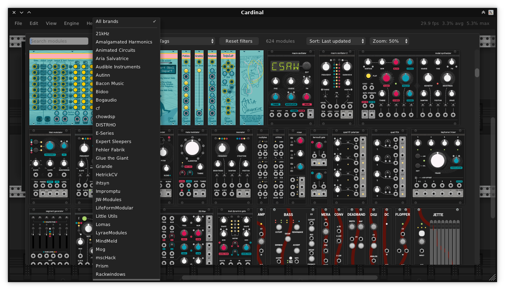
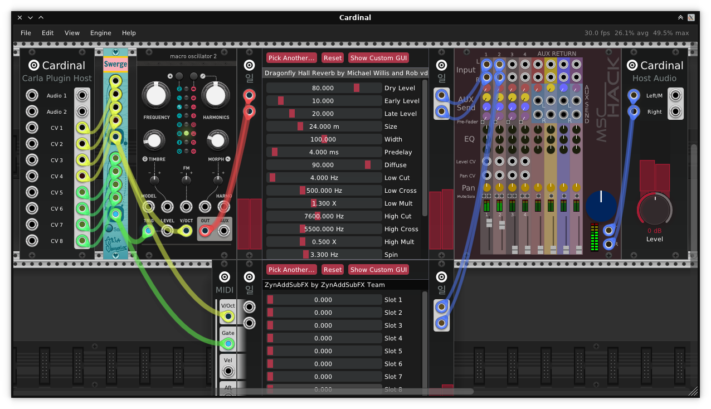
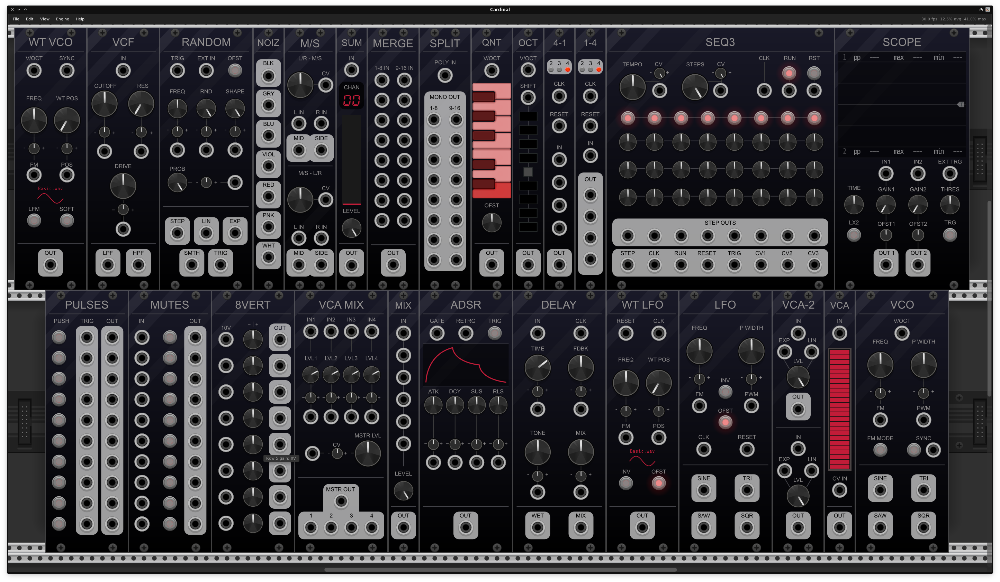

# DISTRHO Cardinal

*Cardinal, the Rack!*

Cardinal is a free and open-source virtual modular synthesizer plugin,
available as JACK standalone and AU, LV2, VST2, VST3 and CLAP audio plugin for FreeBSD, Linux, macOS and Windows.  
It is based on the popular [VCV Rack](https://vcvrack.com/) but with a focus on being a fully self-contained plugin version.

More specifically, this is a [DPF-based](https://github.com/DISTRHO/DPF/)
plugin wrapper around [VCV Rack](https://github.com/VCVRack/Rack/),
using its code directly instead of forking the project,
with the target of having a **proper, self-contained, fully free and open-source plugin version of Rack**.  
See the [why section](#Why) below for the reasons Cardinal exists,
also for frequently asked questions check this [FAQ document](docs/FAQ.md).

Cardinal contains Rack, some 3rd-party modules and a few internal utilities all in a single binary.  
All "Core" modules from Rack have been replaced by Cardinal equivalents, simplified to better work for an audio plugin.

Cardinal does not load external modules and does not connect to the official Rack library/store.  
All VCV branding has been removed (to the best of our knowledge) in order to avoid any trademark issues.

## Current status

Cardinal should be considered stable, if you spot any bugs please report them.  
Currently the following should be noted:

- CLAP support is a work-in-progress [DPF#383](https://github.com/DISTRHO/DPF/issues/383)
- Windows 32bit builds still have a few problematic modules [#80](https://github.com/DISTRHO/Cardinal/issues/80)

### Stable release

Cardinal releases have official builds for Linux, macOS and Windows.  
You can find these under https://github.com/DISTRHO/Cardinal/releases.

There are Linux builds for various architectures (armhf, arm64, i686 and x86_64), macOS "universal" (arm64 + intel) and Windows 32 and 64bit builds.
Both macOS and Windows builds have an installer.  
Install instructions are available [here](https://github.com/DISTRHO/Cardinal/wiki/Install).

Note: Neither the macOS or Windows builds are signed, so expect warnings saying they are from an "untrusted developer".

### Nightly builds

You can find builds for pretty much any recent Cardinal commit [here](https://github.com/DISTRHO/Cardinal/actions/workflows/build.yml).  
Just click on any successful build, and scroll to the bottom to find the builds.  
(note the canvas-like area in the middle prevents mouse wheel scrolling)

A GitHub account is required in order to download these builds.

### Building

Basic building instructions are available in [BUILDING.md](docs/BUILDING.md).

## Plugin variants

Cardinal provides 3 plugin variants - "main", Synth and FX.  
They are all equivalent in performance and behaviour, with only the IO and metadata that changes.  
This is because some hosts are very strict on which plugins are allowed as instruments vs FX, so separate variants of the same plugin are needed.

FX and Synth variants both have 2 audio outputs, while "main" has 8.  
All variants have MIDI input and output support.

### Main

This variant provides 8 audio inputs and outputs and 10 CV inputs and outputs.

NOTE: Due to AU and VST2 formats not supporting CV ports, this variant is not available for those formats.  
NOTE: This variant is not available in CLAP yet, to be added in a later release

### Synth

This variant provides 2 audio outputs but no audio inputs or CV ports.  
Plugin type is set as "instrument".

### FX

This variant provides 2 audio inputs and outputs, but no CV ports.  
Plugin type is set as regular "effect".

## Screenshots

Because people will ask for it. It is, well... Rack.  
But a couple of modules background's have their colors flipped, because damn we want proper dark mode!

### Module browser

### Basic patching

### Carla and Ildaeil plugin hosts

### Custom Fundamental modules design

## Included modules

At the moment the following 3rd-party modules are provided:

- 21kHz
- 8Mode
- Aaron Static
- alef's bits
- AlgoritmArte
- Amalgamated Harmonics
- Animated Circuits
- Arable Instruments
- Aria Salvatrice
- AS
- Audible Instruments
- Autinn
- Axioma
- Bacon Music
- Befaco
- Bidoo
- Bogaudio
- Catro/Modulo
- cf
- ChowDSP
- DrumKit
- E-Series
- ExpertSleepers Encoders
- Extratone
- Fehler Fabrik
- forsitan modulare
- Fundamental
- Glue the Giant
- GoodSheperd
- Grande
- Hampton Harmonics
- HetrickCV
- ihtsyn
- Impromptu
- JW-Modules
- kocmoc
- LifeFormModular
- Lilac Loop
- Little Utils
- Lomas Modules
- Lyrae Modules
- Meander
- MindMeld
- ML Modules
- Mockba Modular
- Mog
- mscHack
- MSM
- Myth
- Nonlinear Circuits
- Orbits
- Parable Instruments
- Path Set
- PinkTrombone
- Prism
- rackwindows
- repelzen
- Sonus Modular
- stocaudio
- unless_modules
- Valley
- Voxglitch
- WhatTheRack
- ZetaCarinae
- ZZC

Additionally Cardinal provides its own modules for DAW/Host automation, time position, audio to CV pitch conversion and internal plugin hosting.

### Adding modules

Install new modules on a Cardinal build is not possible, but we can add new modules to the build.  
Details on this are available [here](https://github.com/DISTRHO/Cardinal/discussions/28).  
Also check [this wiki page](https://github.com/DISTRHO/Cardinal/wiki/Possible-modules-to-include)
where we discuss possible modules to include.  

### Module restrictions

All included modules are open-source and have a GPLv3+ compatible license. (GPLv3-only modules are not allowed)  
It is a requirement that the final Cardinal binary is GPLv3+ licensed.

Module dependencies should be kept at a minimum, as otherwise it quickly grows the complexity of the build.  
Online access (such as phone-home) is not allowed.

Worth noting that a few modules have artwork licensed separately from their code.  
These licenses range from CC-0 to CC-NC-ND to custom (used with permission).  
An overview of the included artwork licenses can be seen [here](docs/LICENSES.md#artwork--panel-licenses).

Even though CC-NC is problematic for packaging (some linux distributions are commercial in nature),
Cardinal allows their use because of how prevalent they are across many Rack modules.  
Even the Rack "Component Library" (which can be considered the base widget elements) is CC-NC licensed.

Any artwork that uses a custom license has had explicit permission to be used in Cardinal.

## Why

Cardinal was created first and foremost as a way to have Rack as a **proper open-source audio plugin**.  
A proper audio plugin should be self-contained as much as possible, as to not interfere with the DAW/Host.
Loading external modules clearly goes against this idea.  
Not to mention being **open-source**, otherwise we are at the mercy of the wishes of a company for what we can and cannot do,
which is not something Cardinal's authors wish to abide by.

A self-contained plugin can't be overstated, as DLL/shared-object symbol conflicts can trigger hard-to-debug crashes.  
While Rack tries to mitigate this as much as possible, crashes due to conflicting modules have already been seen in v2 builds.  
On the other side, Cardinal redefines class and function names as needed to avoid as many conflicts as possible.

Support for ARM and non-mainstream platforms (for example BSD) has also always been missing from the official Rack since the start.  
While we can patch the Rack free version to support these, same can't be done with Rack Pro with it being a closed-source product.  
The online library/store only supports a very specific set of platforms too,
so non-supported platforms would need any 3rd-party modules to be manually compiled to make them usable.

Unhappiness with the audio threading behaviour of Rack also plays a role.  
Both audio and MIDI should be locked to the host audio thread as to minimize (or even altogether remove) latency and jitter.  
The use of separate threads for MIDI is bad design, one that has been corrected in DAWs and JACK-MIDI for several years...  
But Rack's use of RtMidi requires separate threading, so Cardinal does not use it.

Other relevant reasons include:

 - LV2 plugin version from the start
 - Proper dark mode support
 - Proper optimized build (because all code is compiled to a single file, we can use LTO over the whole thing)
 - Real CV ports to and from the plugin
 - Removing online access from the plugin and included modules (no phone-home here!)
 - Works as a test case for [DPF](https://github.com/DISTRHO/DPF/) and [Carla](https://github.com/falkTX/Carla/)
 - It is fun :)

## Vs. Rack Pro

It needs to be said that Cardinal project and its author(s) do not wish anything bad to the original/official Rack project.  
In fact, Cardinal wouldn't exist if not for Rack v2 release. (which has many needed things to make a plugin version work)

Cardinal and Rack should be able to co-exist friendly and peacefully, as they clearly have different targets.  
It is likely most people will prefer to use Rack Pro for its official support and its big module collection (including commercial ones).

A feature comparison between Cardinal and Rack Pro can be seen [here](docs/DIFFERENCES.md).

## License

Cardinal is licensed under GPLv3+, see [LICENSE](LICENSE) for more details.  
An overview of the included code and linked submodules can be seen [here](docs/LICENSES.md#code-license--binary).

## Community chat

Currently we are all on #cardinal IRC room in irc.libera.chat server.  
Come join us in your favorite IRC client or through a Matrix bridge.
