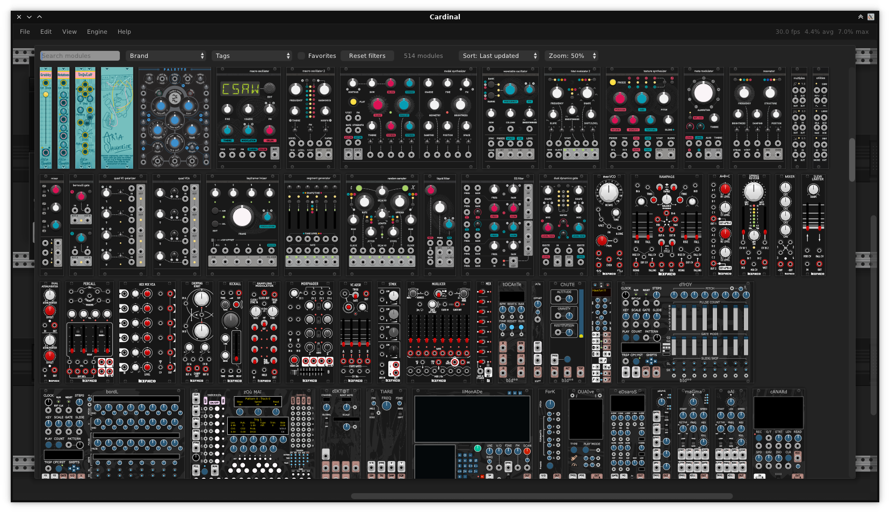

# DISTRHO Cardinal

*Cardinal, the Rack!*

**! THIS PROJECT IS A WORK IN PROGRESS !**

This is a [DPF-based](https://github.com/DISTRHO/DPF/) plugin wrapper around [VCV Rack](https://github.com/VCVRack/Rack/),
using its code directly instead of forking the project.  
The target is to have a **proper, self-contained, fully free and open-source plugin version of Rack**.  
See [project overview](doc/OVERVIEW.md) document for an overview on how the project source code is structured.

Cardinal contains Rack, some 3rd-party modules and a few internal utilities all in a single binary.  
It does not load external modules and does not connect to the official Rack library/store.

Because it is using DPF, Cardinal already supports LV2 and VST2 with an extra JACK standalone mode if self-compiled.  
A VST3 version is in progress, already part of the build but still experimental.

**The project should be considered in beta state at the moment.**

## Plugin variants

Cardinal provides 3 plugin variants - "main", Synth and FX.  
They are all equivalent in performance and behaviour, with only the IO and metadata that changes.  
This is because some hosts are very strict on which plugins are allowed as instruments vs FX, so separate variants of the same plugin are needed.

All variants have 2 audio outputs and MIDI support.

### Main

This variant provides 2 audio inputs and outputs and 10 CV inputs and outputs.  

NOTE: Due to VST2 format not supporting CV ports, this variant is not available for VST2.

### Synth

This variant provides 2 audio outputs but no audio inputs or CV ports.  
Plugin type is set as "instrument".

### FX

This variant provides 2 audio inputs and outputs, but no CV ports.  
Plugin type is set as regular "effect".

## Screenshots

Because people will ask for it. It is, well... Rack.  
But a couple of modules background's have their colors flipped, because damn we want proper dark mode!

## Current status

Most of the features already work, you can assume things work in general except when stated otherwise.  
Currently the following features are known NOT to work:

- Clock related triggers in built-in MIDI modules [#25](https://github.com/DISTRHO/Cardinal/issues/25)
- VST3 support incomplete/experimental [#41](https://github.com/DISTRHO/Cardinal/issues/41)
- Factory (plugin-provided) presets [#58](https://github.com/DISTRHO/Cardinal/issues/58)
- File dialogs triggered by module right-click menus [#76, in progress](https://github.com/DISTRHO/Cardinal/issues/76)

### Current builds

If you want to try this out early, checkout the [GitHub actions tab](https://github.com/DISTRHO/Cardinal/actions/workflows/build.yml).  
There is absolutely no warranty, use at your own risk and all that...

### Community chat

Currently we are all on #cardinal IRC room in irc.libera.chat server.  
Come join us in your favorite IRC client or through a Matrix bridge.

## License

Cardinal is licensed under GPLv3+, see [LICENSE](LICENSE) for more details.  
An overview of the included code and linked submodules can be seen [here](doc/LICENSES.md).

## Included modules

At the moment the following 3rd-party modules are provided:

- 21kHz
- AS
- Amalgamated Harmonics
- Animated Circuits
- Aria Salvatrice
- Atelier
- Audible Instruments
- Bacon Music
- Befaco
- Bidoo
- Bogaudio
- cf
- ChowDSP
- DrumKit
- E-Series
- Fehler Fabrik
- Fundamental
- Glue the Giant
- Grande
- HetrickCV
- Impromptu
- JW-Modules
- LifeFormModular
- Little Utils
- LyraeModules
- MindMeld
- Mog
- mscHack
- Rackwindows
- repelzen
- Sonus Modular
- Valley
- ZZC
- ZetaCarinae

Additionally Cardinal provides its own modules for DAW/Host automation, time position and internal plugin hosting.

### Restrictions

Being an open-source project, all included 3rd-party modules must be opensource and have a GPLv3+ compatible license.
*GPLv3-only modules are not allowed*.

Special care also needs to be taken with artwork licensing.  
Cardinal allows the use of CC-NC because how prevalent it is across many Rack modules, but it should be avoided if possible.  
Also, unless the module is really essential, CC-ND is not allowed.

Dependencies should be kept at a minimum, as otherwise it quickly grows the complexity of the build.  
Online access (such as phone-home) is not allowed.

## Why

Cardinal was created first and foremost as a way to have Rack as a **proper open-source audio plugin**.  
A proper audio plugin should be self-contained as much as possible, as to not interfere with the DAW/Host.
Loading external modules clearly goes against this idea.  
Not to mention being **open-source**, otherwise we are at the mercy of the wishes of a company for what we can and cannot do,
which is not something Cardinal's authors wish to abide by.

A self-contained plugin can't be overstated, as DLL/shared-object symbol conflicts can trigger hard-to-debug crashes.  
While Rack tries to mitigate this as much as possible, crashes due to conflicting modules have already been seen in v2 builds.  
On the other side, Cardinal redefines class and function names as needed to avoid as many conflicts as possible.

Support for ARM and non-mainstream platforms (for example BSD) has also always been missing from the official Rack since the start.  
While we can patch the Rack free version to support these, same can't be done with Rack Pro with it being a closed-source product.  
The online library/store only supports a very specific set of platforms too,
so non-supported platforms would need any 3rd-party modules to be manually compiled to make them usable.

Unhappiness with the audio threading behaviour of Rack also plays a role.  
Both audio and MIDI should be locked to the host audio thread as to minimize (or even altogether remove) latency and jitter.  
The use of separate threads for MIDI is bad design, one that has been corrected in DAWs and JACK-MIDI for several years...  
But Rack's use of RtMidi requires separate threading, so Cardinal does not use it.

Other relevant reasons include:

 - LV2 plugin version from the start
 - Proper dark mode support
 - Proper optimized build (because all code is compiled to a single file, we can use LTO over the whole thing)
 - Real CV ports to and from the plugin
 - Removing online access from the plugin and included modules (no phone-home here!)
 - Works as a test case for [DPF](https://github.com/DISTRHO/DPF/) and [Carla](https://github.com/falkTX/Carla/)
 - It is fun :)

## Vs. Rack Pro

It needs to be said that Cardinal project and its author(s) do not wish anything bad to the original/official Rack project.  
In fact, Cardinal wouldn't exist if not for Rack v2 release. (which has many needed things to make a plugin version work)

Cardinal and Rack should be able to co-exist friendly and peacefully, as they clearly have different targets.  
It is likely most people will prefer to use Rack Pro for its official support and its big module collection (including commercial ones).

A feature comparison between Cardinal and Rack Pro can be seen [here](doc/DIFFERENCES.md).
