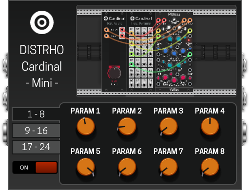

# Cardinal manual for MOD Devices

This document briefly describes how to use Cardinal with a [MOD device](https://www.moddevices.com/).  
It is intended for this documentation to be part of the plugin bundle when installed from the
[MOD Plugin store](https://pedalboards.moddevices.com/plugins).

## Plugin overview

Cardinal is a free and open-source virtual modular synthesizer plugin,.  
It is based on the popular [VCV Rack](https://vcvrack.com/) but with a focus on being a fully self-contained plugin version.

If you already know Rack, Cardinal will be very familiar to you.

## Plugin usage

Currently Cardinal does not allow patch editing directly on the MOD units,
instead users need to run the "desktop" version of the plugin and connect it to the device.  
This is easily done by the use of "File" -> "Connect to MOD" action.

After a successful connection, the same "File" menu will now show a "Deploy to MOD" option.  
Clicking on it will push the current patch to the MOD unit, along with a screenshot of the current view.  
You can also use the F7 shortcut key to do the same.

Additionally, enabling "Auto-deploy to MOD" will make Cardinal (the "desktop" plugin side)
automatically send the current patch to the MOD unit after 5 seconds of inactivity.

### Notes and caveats

This push-to-device workflow is very limited, it will improve in a future release.  
For now it can already work to push existing or new patches to the unit.  
After you push a patch, you can use MOD preset system to save a patch as plugin preset,
which will allow you to load it at a different time without the need for the "desktop" connection.

There are a few critical things to take into consideration for this release:

- Only one Cardinal instance is reachable in terms of desktop -> MOD connection,
you can and should use multiple instances when there is no desktop connection though
- The MOD unit must be connected over USB, so that the 192.168.51.1 IP is reachable
- The Audio File, Carla and Ildaeil modules are not available in MOD builds
- Lights and meters from the Cardinal MOD side are not transmitted back to the desktop side
- Compared to desktop, MOD builds are not as fast, so do not expect to load big patches
