# Cardinal Modules

This file contains documentation for the DISTRHO Cardinal modules.

## Main modules

### Audio File

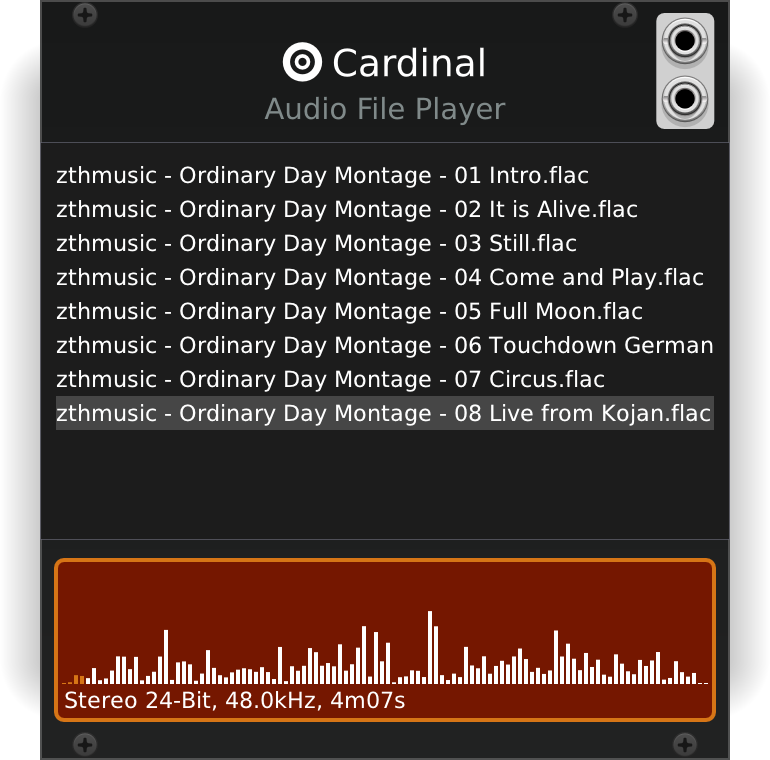

This is a simple audio file player plugin.  
You can load files by using right-click menu options.

Transport is rolling as long as the plugin is enabled and a file has been loaded.  
You can also sync to host transport, which will play in frame-perfect sync, useful if you need a few loops playing together.

Files are streamed from disk if longer than 30 seconds in length, otherwise loaded entirely on RAM.

Even though this player plugin can loop files, it is not an audio looper.  
Audio can loop back to the beginning if enabled, but it does not resample or pitch-shift to fit the host BPM.  
The audio files are played back as-is, with resampling only done when needed to match the host sample rate.

### Audio To CV Pitch

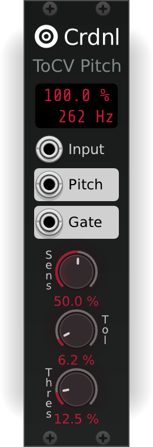

The Audio To CV Pitch module is a tool that turns your audio signal into CV pitch and CV gate signals.  
This allows audio from instruments (such as guitars) to play and control synth sounds and effects.

It detects the pitch in your incoming audio signal and outputs a 1V/Oct CV pitch signal on the "Pitch Out" CV port.  
The "Gate" CV port sends out 10V while a pitch is detected, and resets to 0V when the pitch can no longer be detected.

There is an Octave right-click option that allows you to shift the detected pitch up or down by a maximum of 4 octaves.  
When set to 0, it will output the same pitch as is detected on the input.

Then the "Hold Output Pitch" right-click option sets whether the plugin resets its outputs to 0, or holds the last detected pitch.

The Sensitivity parameter can be increased to detect quieter signals, or decreased to reduce artifacts.  
The Confidence Threshold can be increased to make sure the correct pitch is being output, or decrease it to get a faster response time.  
And finally, the Tolerance parameter influences how quickly you can change pitch, turn it down for a more accurate pitch output, or turn it up to make it easier to jump from one pitch to the next.

### Carla

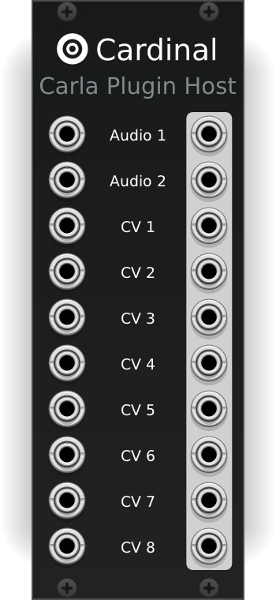

[Carla](https://kx.studio/Applications:Carla) is a fully-featured modular audio plugin host.  
This is a Cardinal/Rack module of Carla with 2 audio and 8 CV IO.  
Double-click on the panel to show the Carla's own window.

Note it is required for Carla to be installed on your system in order to show its GUI.  
This is currently not supported under Windows.

MIDI input and output are possible with the use of expander modules.

By default Carla will have an offset on its CV inputs and outputs so that 0 to 10v from Carla generates -5 to 5v in Cardinal, and vice-versa.  
This allows to easily route between bipolar and unipolar+ signals.  
You can change this with right-click menu options, in case you want no offset to be applied.

### Ildaeil

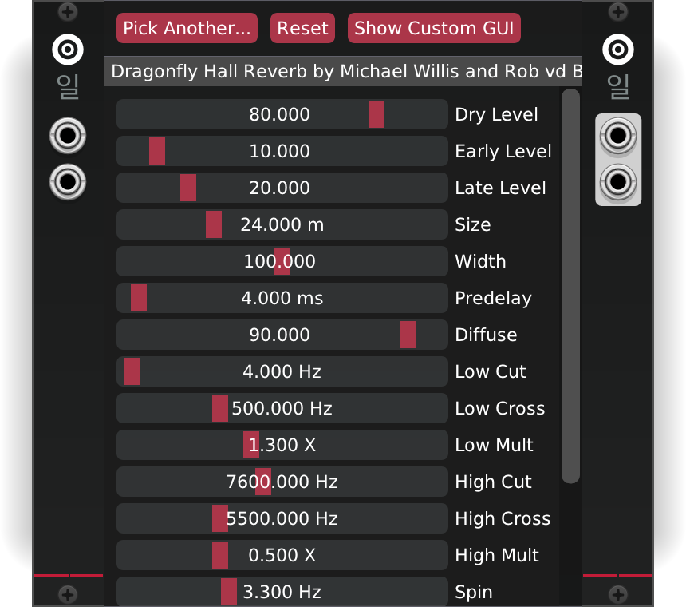

[Ildaeil](https://github.com/DISTRHO/Ildaeil) is a mini-plugin host based on [Carla](https://kx.studio/Applications:Carla).  
This is a Cardinal/Rack module of Ildaeil with 2 audio IO.

Currently Ildaeil supports (Carla) internal and LV2 plugins.  
More plugin support will be added in future releases.

There is no way to automate hosted plugin parameters yet.

MIDI input and output are possible with the use of expander modules.

### Host Audio

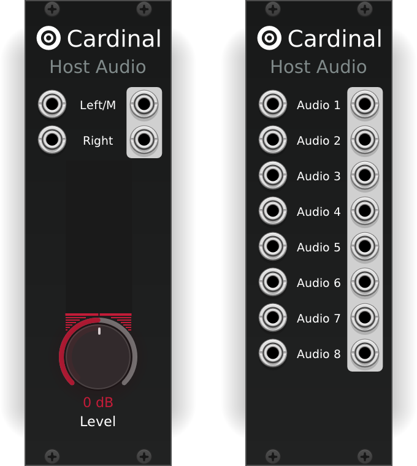

A module for getting audio to and from your Host/DAW.  
Works just like the Rack equivalent, including a DC filter that is enabled by default on the stereo version, disabled on the 8 IO variant.

On the stereo version, connecting to the Left/Mono input jack will automatically mirror that signal on the Right, unconnected jack.  
This is the same behaviour as present in Rack, but without signal delay.

Note that, unlike Rack, Cardinal does not provide a 16 IO audio module.

### Host CV

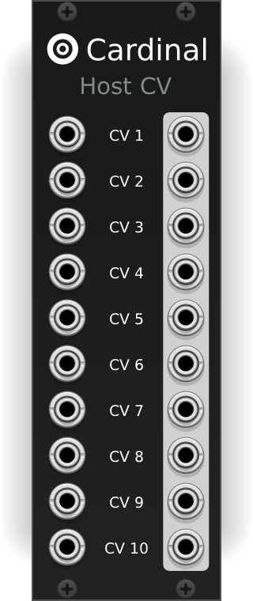

For getting CV to and from your Host/DAW.

Just as with the Carla module, you can enable right-click menu options to automatically apply an offset to the CV signal.  
For convenience this mode is split on the 1-5 and 6-10 ports, in case you need some to be bipolar and some unipolar.

Note that this module does nothing on Cardinal's FX and Synth variants, as they do not have host-exposed CV IO.

### Host MIDI

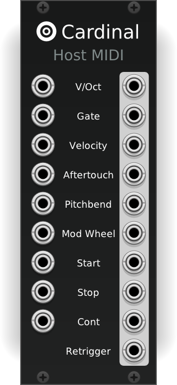

For getting regular MIDI to and from your Host/DAW.  
It has pretty much the same options and functionality as the Rack MIDI2CV and CV2MIDI modules, but combines them into one.

Clock pulses are not available on this module in Cardinal, prefer to use Host Time module for that.

### Host MIDI CC

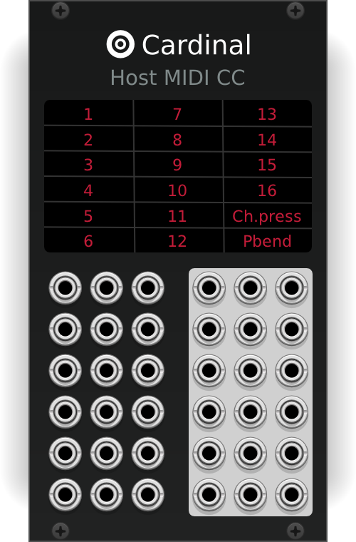

For getting regular MIDI CCs to and from your Host/DAW.  
It has pretty much the same options and functionality as the Rack MIDI-CC2CV and CV2MIDI-CC modules, but combines them into one.

Direct channel pressure and pitchbend ports are available for convenience.

### Host MIDI Gate

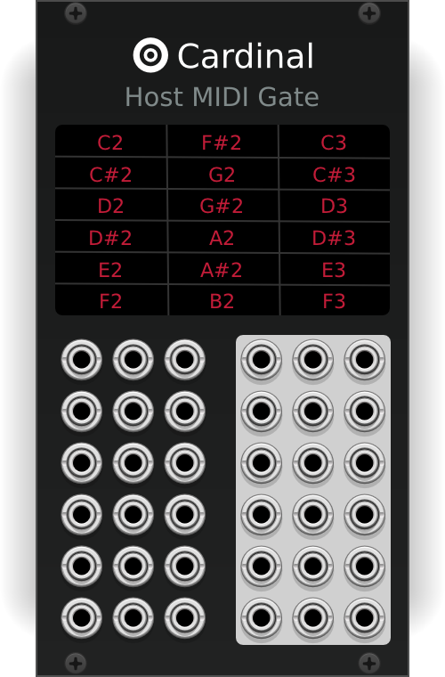

For getting regular MIDI Notes as Gates to and from your Host/DAW.  
It has pretty much the same options and functionality as the Rack MIDI-Gate2CV and CV2MIDI-Gate modules, but combines them into one.

### Host MIDI CC Map

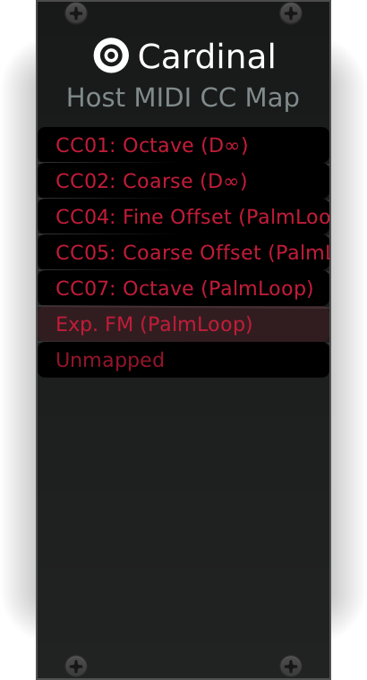

For mapping MIDI CCs from your Host/DAW into module parameters.  
It has pretty much the same options and functionality as the Rack MIDI-Map.

### Host Parameters

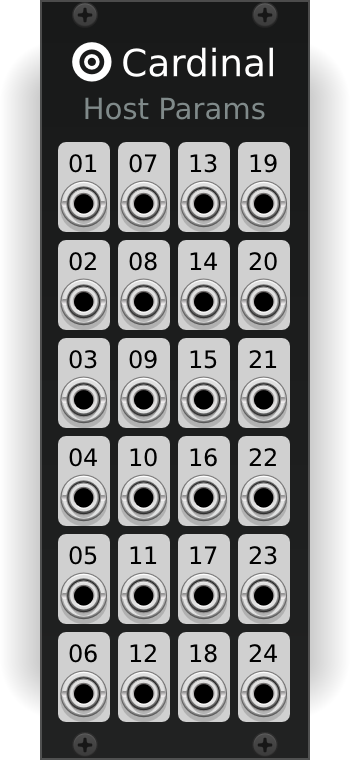

For automating CV sources from the host side, this module directly converts the 24 Cardinal host-exposed parameters into CV signals inside Cardinal.

The parameters have an internal slew limiter in order to smooth out the changes over time.  
The fall time of the smoothing filter is based on the current host block size and sample rate.

### Host Time

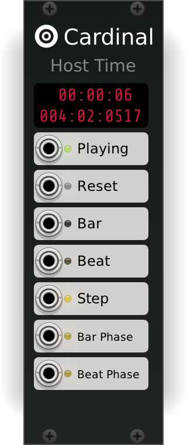

For getting time information from your DAW as precise clock triggers.

Unlike Rack, Cardinal does not use PPQN (pulses per quarter note) values, but BBT (bar-beat-tick) instead.

The top of the panel has a timer display to help understand how and what the host is doing.  
The first line is the song time in seconds, and second line is the BBT.

## Extra modules

### Blank

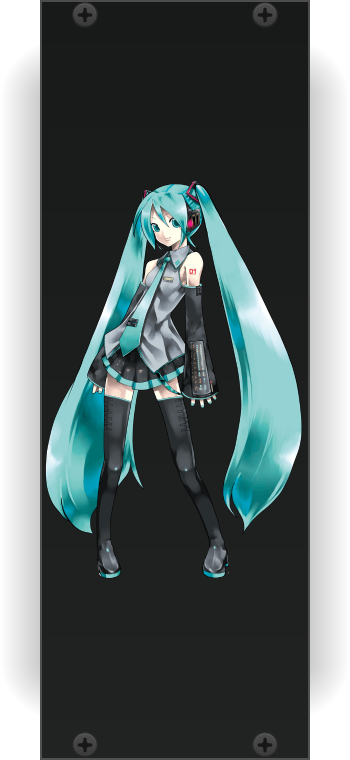

Every collection needs a blank panel.  
Cardinal features Hatsune Miku on its blank panel, because yes. :)

Actually, it is just that CC-NC artwork and resources are very common-place within the Rack plugins ecosystem.  
Typically we would want to avoid those, but when you got pretty much every author using CC-NC, let's go all in then...  
So yes, the design used on this panel is [CC-NC licensed](https://piapro.net/intl/en_for_creators.html).

If you ask why Miku, well, why not. And why not even something else.
If you find other content we can use, under clear license terms, maybe it could be added as blank panel too.

Sometimes we just need to have fun. :)

### Sassy Scope

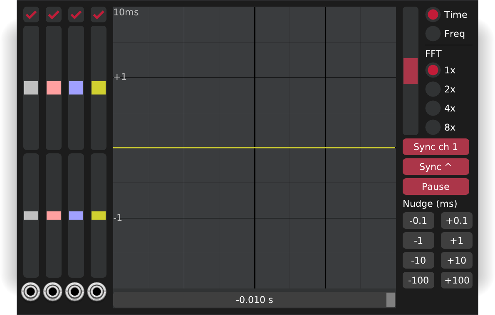

The virtual oscilloscope from the [Sassy Spreadsheet](https://github.com/jarikomppa/sassy) project.  
Features time and frequency analysis, input-based trigger sync and allows to pause the analysis for careful inspection.

Line colors follow the color of the cable connected to its respective input.

### Expanders MIDI

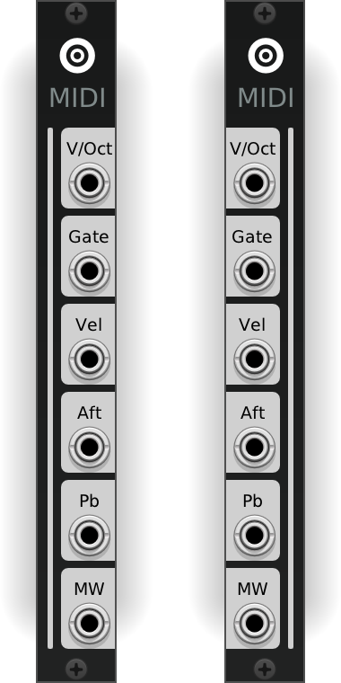

These are expanders for Carla and Ildaeil, allowing MIDI input and output.  
When connected (that is, standing next to them) the graphics on Carla/Ildaeil side will change a bit to indicate it is being used.

### MPV

This is a super experimental embed video player inside Cardinal.

It is mostly just a test for embedding external windows inside Cardinal, `mpv` simply provides a nice way to do it.

This is not intended to be a serious module in any way, purely experimental and made for development purposes.

### glBars

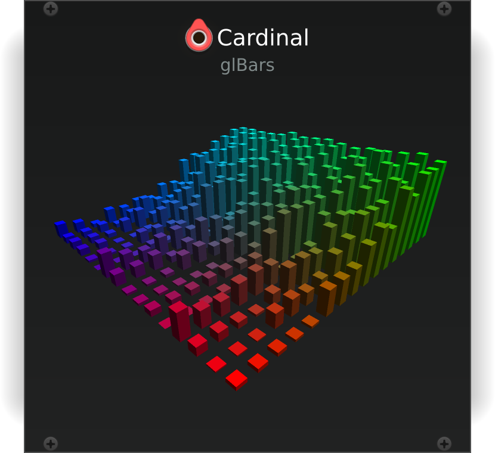

An OpenGL bars visualization, as seen in XMMS and XBMC/Kodi.

It is purely cosmetic.

This module was done early in Cardinal's development as a way to test drawing a module using OpenGL.  
It remains as a test case and example for others to base new modules on.

### Text Editor

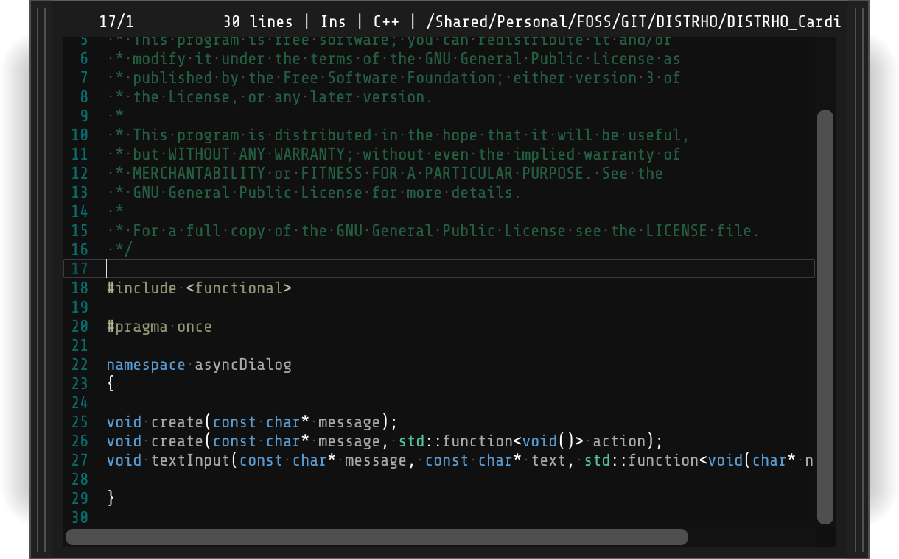

A text editor inside Cardinal, with support for syntax highlighting.

It supports the typical things you expect from an editor, such as copy&paste and undo&redo.

The panel is resizable using the left and right borders.  
Moving the panel around can be done by grabbing the top status bar of the editor.
