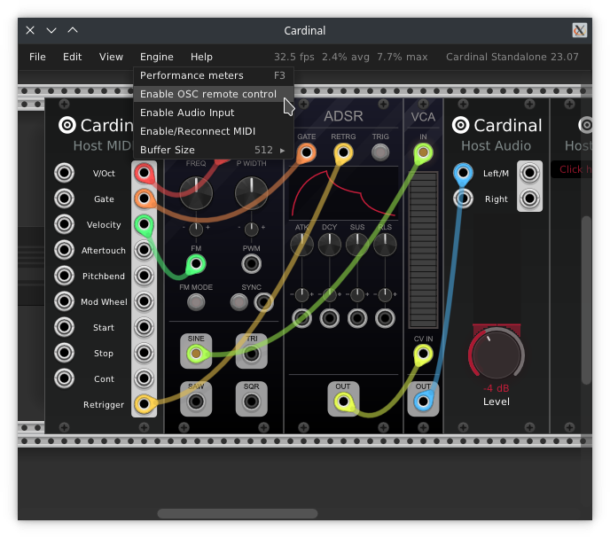
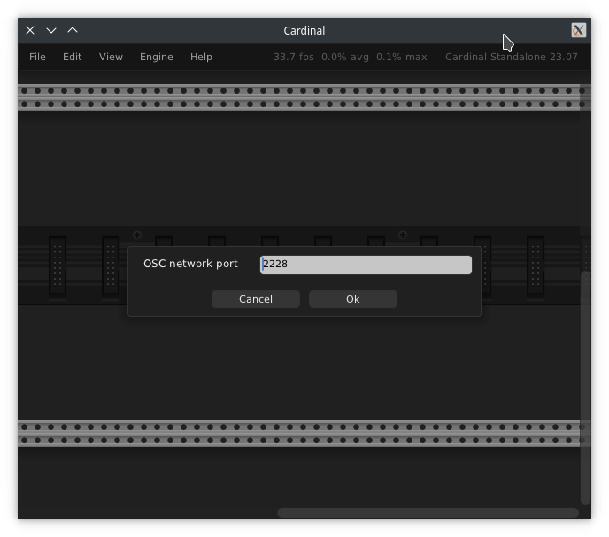

# OSC Remote Control

OSC (Open Sound Control) is a protocol commonly used for remote control over the network.  
Starting with version 23.09, Cardinal allows remote control of the entire patch/project and individual parameters through OSC.

Please note **OSC Remote Control is not available when using Cardinal as a plugin**, only in standalone.

## Activating remote control

Make sure you are using version 23.09 or later of Cardinal, start up the standalone (both Native and JACK variants will work) and under "Engine" menu click on "Enable OSC remote control".



This will ask you for which network port to use, Cardinal will default to 2228.  
Valid range is typically between 1025 and 32767.  
If unsure just stick the default value.



Depending on the OS security features you might be asked to allow network usage at this point.  
If all went well opening the "Engine" menu again should show a checkmark, indicating that OSC remote control is enabled.

For the moment there is no error dialog or information in case things go wrong.  
If you are unable to connect, make sure your OS network firewall settings allows opening port 2228.

### Automatic startup using command line

To start the OSC server automatically when Cardinal starts up, you can do a headless build and pass the environment variable
```sh
cardinal CARDINAL_REMOTE_HOST_PORT=2228
```
This can be useful, for example: starting Cardinal for an art exhibit where no mouse/keyboard are attached but you want remote control.

## TouchOSC example setup

A TouchOSC compatible file is available [here](https://github.com/DISTRHO/Cardinal/raw/main/patches/touchosc/24-direct-fader-params.tosc).

It maps Cardinal's 24 parameters into 3 pages of sliders, 8 per page, each with a different color.  
Inside Cardinal the Host Parameters and Host Parameters Map modules can be used as a way to control module knobs and other controls with it.

## Available messages

The following OSC messages are available:

#### /hello

Sending a `/hello` message will make Cardinal reply back with another hello, using `/resp` path and "hello" message.  
Useful when testing if the connection works.

#### /host-param i:port f:value

Sending a `/host-param` message will set a port value of the "Host Params" module.  
The port index starts from 0.

There is no reply back from Cardinal.

#### /param h:moduleId i:paramId f:value

Sending a `/param` message will change the parameter value of any loaded module.  
(TODO: describe a way to find the module and param id)

There is no reply back from Cardinal.

NOTE: the first argument must of be int64 type, as regular 32-bit integer is not enough to fit the whole range of values used inside Cardinal/Rack.

#### /load b:patch-blob

Sending a `/load` message will load the patch file contained in the message.  
Patch contents must be in compressed format, not plain-text json.

Cardinal replies back indicating either success or failure, using `/resp` path and "load" message.
