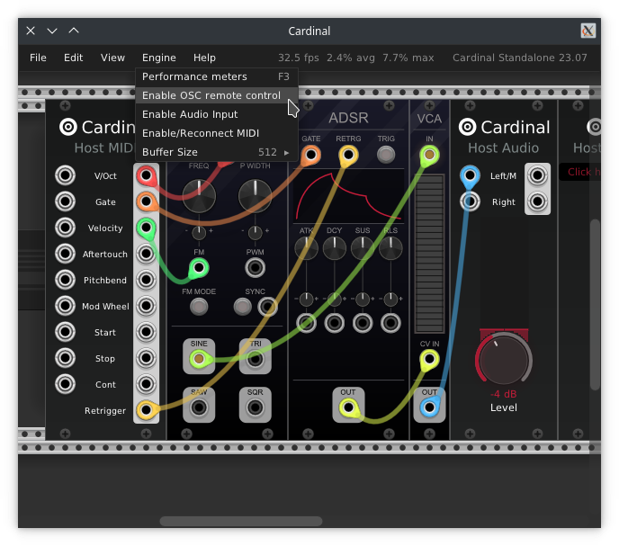
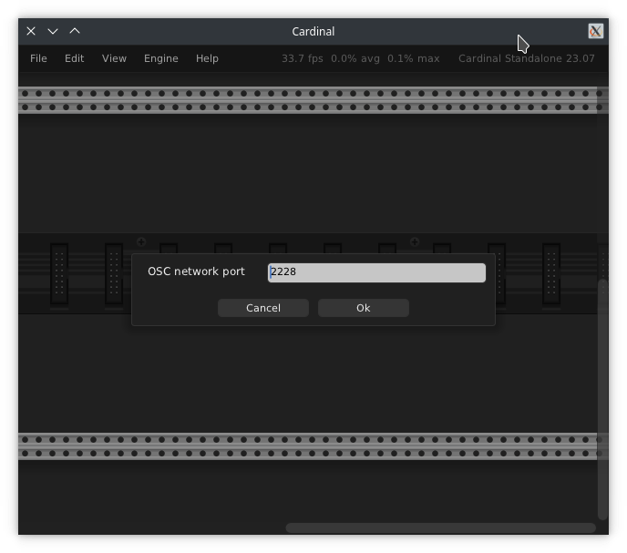

# OSC Remote Control

OSC (Open Sound Control) is a protocol commonly used for remote control over the network.  
Starting with version 23.09, Cardinal allows remote control of the entire patch/project and individual parameters through OSC.

Please note **OSC Remote Control is not available when using Cardinal as a plugin**, only in standalone.

## Activating remote control

Make sure you are using version 23.09 or later of Cardinal, start up the standalone (both Native and JACK variants will work) and under "Engine" menu click on "Enable OSC remote control".



This will ask you for which network port to use, Cardinal will default to 2228.  
Valid range is typically between 1025 and 32767.  
If unsure just stick the default value.



Depending on the OS security features you might be asked to allow network usage at this point.  
If all went well opening the "Engine" menu again should show a checkmark, indicating that OSC remote control is enabled.

For the moment there is no error dialog or information in case things go wrong.  
If you are unable to connect, make sure your OS network firewall settings allows opening port 2228.

### Automatic startup on headless builds

If you do a headless build there is no UI to click on to enable remote control, so for this reason the headless builds (standalone, not plugins) will have OSC remote control enabled by default.

To change the port for the OSC server use the `CARDINAL_REMOTE_HOST_PORT` environment variable, for example:
```sh
env CARDINAL_REMOTE_HOST_PORT=2228 CardinalNative
```

This can be useful for starting Cardinal where no mouse/keyboard are attached but you want remote control.

## TouchOSC example setup

A TouchOSC compatible file is available [here](https://github.com/DISTRHO/Cardinal/raw/main/patches/touchosc/24-direct-fader-params.tosc).

It maps Cardinal's 24 parameters into 3 pages of sliders, 8 per page, each with a different color.  
Inside Cardinal the Host Parameters and Host Parameters Map modules can be used as a way to control module knobs and other controls with it.

## Available messages

The following OSC messages are available:

#### /hello

Sending a `/hello` message will make Cardinal reply back with another hello, using `/resp` path and "hello" message.  
Useful when testing if the connection works.

#### /host-param i:port f:value

Sending a `/host-param` message will set a port value of the "Host Params" module.  
The port index starts from 0.

There is no reply back from Cardinal.

#### /param h:moduleId i:paramId f:value

Sending a `/param` message will change the parameter value of any loaded module.  
(Use `/modules/list` to find module IDs. Param IDs are module-specific and can be listed with `/module/params`.)

There is no reply back from Cardinal.

NOTE: the first argument must of be int64 type, as regular 32-bit integer is not enough to fit the whole range of values used inside Cardinal/Rack.

#### /modules/list

Sending a `/modules/list` message will return the list of loaded modules and their IDs as a stream of replies.  
Cardinal replies back using `/resp` with "modules" and a JSON payload string for each module, for example:

```json
{"ok":true,"index":0,"total":4,"module":{"id":123,"plugin":"Fundamental","model":"VCO-1","name":"VCO-1","fullName":"VCV VCO-1"}}
```

Clients should collect replies until `index + 1 == total`.
If `total` is `0`, a single reply is sent with `param` set to `null`.

#### /modules/available

Sending a `/modules/available` message will return available modules (non-hidden) as a stream of replies.  
Cardinal replies back using `/resp` with "modules-available" and a JSON payload string for each module, for example:

```json
{"ok":true,"index":0,"total":1234,"module":{"plugin":"Fundamental","model":"VCO-1","name":"VCO-1","fullName":"VCV VCO-1"}}
```

Clients should collect replies until `index + 1 == total`.
If `total` is `0`, a single reply is sent with `input` set to `null`.

#### /module/add s:pluginSlug s:modelSlug
#### /module/add s:pluginSlug s:modelSlug i:gridX i:gridY

Sending a `/module/add` message will create a module by plugin/model slug.  
If `gridX/gridY` are provided, the module is placed at that grid position (0,0 is the top-left grid).  
If no position is provided, the module is placed at the nearest free slot to avoid overlaps.

Cardinal replies back using `/resp` with "module-add" and a JSON payload string, for example:

```json
{"ok":true,"id":123,"plugin":"Fundamental","model":"VCO-1"}
```

#### /module/remove h:moduleId

Sending a `/module/remove` message will remove a module by ID.  
Cardinal replies back using `/resp` with "module-remove" and a JSON payload string, for example:

```json
{"ok":true,"id":123}
```

#### /module/info h:moduleId

Sending a `/module/info` message will return details about a module by ID.  
Cardinal replies back using `/resp` with "module-info" and a JSON payload string, for example:

```json
{"ok":true,"module":{"id":123,"plugin":"Fundamental","model":"VCO-1","name":"VCO-1","fullName":"VCV VCO-1","paramCount":8,"inputCount":4,"outputCount":2,"lightCount":3,"pos":[0,0]}}
```

#### /module/params h:moduleId

Sending a `/module/params` message will return the parameter list (IDs and basic metadata) for a module by ID as a stream of replies.  
Cardinal replies back using `/resp` with "module-params" and a JSON payload string for each parameter, for example:

```json
{"ok":true,"index":0,"total":8,"id":123,"param":{"id":0,"name":"Frequency","min":-4.0,"max":6.0,"default":0.0,"value":0.12}}
```

Clients should collect replies until `index + 1 == total`.
If `total` is `0`, a single reply is sent with `output` set to `null`.

#### /module/inputs h:moduleId

Sending a `/module/inputs` message will return the input port list (IDs and basic metadata) for a module by ID as a stream of replies.  
Cardinal replies back using `/resp` with "module-inputs" and a JSON payload string for each input, for example:

```json
{"ok":true,"index":0,"total":2,"id":123,"input":{"id":0,"name":"Pitch","fullName":"Pitch input"}}
```

Clients should collect replies until `index + 1 == total`.

#### /module/outputs h:moduleId

Sending a `/module/outputs` message will return the output port list (IDs and basic metadata) for a module by ID as a stream of replies.  
Cardinal replies back using `/resp` with "module-outputs" and a JSON payload string for each output, for example:

```json
{"ok":true,"index":0,"total":1,"id":123,"output":{"id":0,"name":"Out","fullName":"Out output"}}
```

Clients should collect replies until `index + 1 == total`.

#### /cables/list
#### /cables/list h:moduleId

Sending a `/cables/list` message will return the list of cables as a stream of replies.  
If `moduleId` is provided, only cables connected to that module are included.  
Cardinal replies back using `/resp` with "cables" and a JSON payload string for each cable, for example:

```json
{"ok":true,"index":0,"total":2,"cable":{"id":123,"outputModuleId":1,"outputId":0,"inputModuleId":2,"inputId":0}}
```

Clients should collect replies until `index + 1 == total`.
If `total` is `0`, a single reply is sent with `cable` set to `null`.

#### /cable/add h:outputModuleId i:outputId h:inputModuleId i:inputId

Sending a `/cable/add` message will connect an output port to an input port.  
Cardinal replies back using `/resp` with "cable-add" and a JSON payload string, for example:

```json
{"ok":true,"id":123,"outputModuleId":1,"outputId":0,"inputModuleId":2,"inputId":0}
```

#### /cable/remove h:cableId

Sending a `/cable/remove` message will remove a cable by ID.  
Cardinal replies back using `/resp` with "cable-remove" and a JSON payload string, for example:

```json
{"ok":true,"id":123}
```

#### /load b:patch-blob

Sending a `/load` message will load the patch file contained in the message.  
Patch contents must be in compressed format, not plain-text json.

Cardinal replies back indicating either success or failure, using `/resp` path and "load" message.
